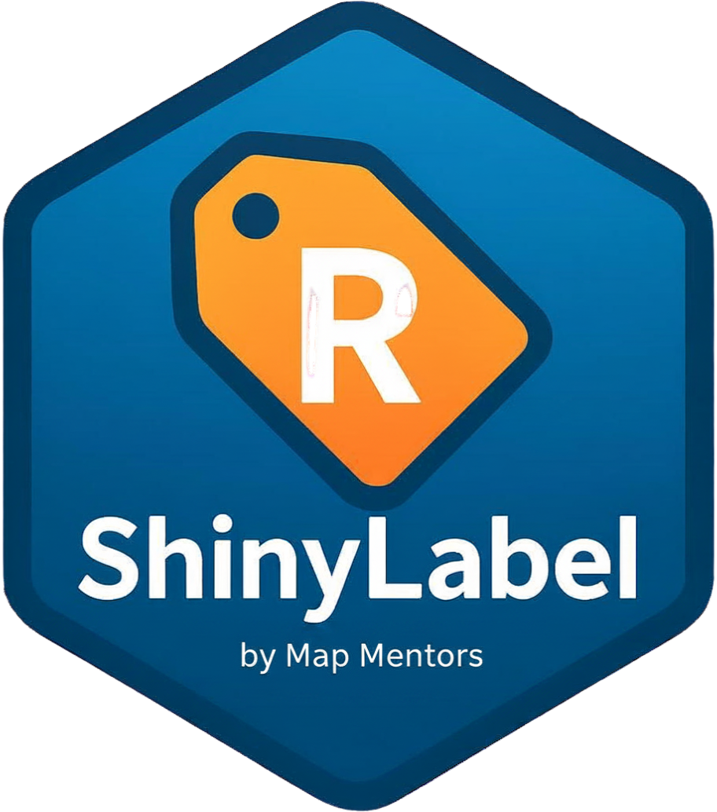

# ShinyLabel 🏷️

**A fully R-native image annotation tool for YOLO object detection.**  
Built as an alternative to LabelImg — no Python, no external tools, runs entirely in R + Shiny.

<p align="center">
  
</p>

<p align="center">
  <a href="https://github.com/Lalitgis/ShinyLabel/blob/main/LICENSE.md"></a>
  <a href="https://github.com/Lalitgis/ShinyLabel/issues"></a>
  = 4.1.0"/>
</p>

---

## Features

| Feature | Details |
|---------|---------|
| **Draw** | Click-drag bounding boxes on any image |
| **Edit** | Select, move, resize (8 handles), delete boxes |
| **Undo** | Full undo stack (Ctrl+Z) |
| **Classes** | Dynamic class management with colour coding |
| **Load** | Upload files, point to a local folder, or load from URL |
| **Team** | Multi-annotator with username tracking |
| **Auto-save** | Annotations saved automatically on image navigation |
| **Storage** | SQLite (WAL mode) — serverless, concurrent, zero extra install |
| **Export** | YOLO Ultralytics `.txt` + `data.yaml` + COCO JSON |
| **Dashboard** | Progress stats, boxes per class, annotator breakdown |

---

## Installation

### Option 1 — install from GitHub (recommended)

```r
# install.packages("devtools")  # if you don't have it yet
devtools::install_github("Lalitgis/ShinyLabel")
```

Then launch the app:

```r
library(shinylabel)
run_shinylabel()
```

### Option 2 — run directly from a cloned repo (no install needed)

```r
# Clone the repo first, then in R:
install.packages(c(
  "shiny", "bslib", "DBI", "RSQLite", "magick",
  "shinyFiles", "shinyjs", "jsonlite", "ggplot2",
  "DT", "dplyr", "lubridate", "zip", "yaml",
  "scales", "colourpicker", "base64enc", "fs"
))

shiny::runApp("inst/app")
```

### Team setup — shared network drive

```r
# All annotators point to the same .db file on a shared drive.
run_shinylabel(
  db_path = "//yourserver/shared/project/annotations.db",
  host    = "0.0.0.0",   # expose on LAN
  port    = 3838
)
```

---

## How It Works

### Canvas engine

The annotation canvas is built with plain **HTML5 Canvas + vanilla JavaScript** (no external JS frameworks). Boxes are drawn with mouse events:

- `mousedown` → start draw or select/drag
- `mousemove` → draw ghost box or move/resize
- `mouseup` → finalise

Coordinates are tracked in **image pixel space** (not canvas display space), so zoom and scaling never affect annotation accuracy.

### Coordinate flow

```
User draws on canvas
  ↓
JS canvas.js tracks pixel coords (image space)
  ↓
Shiny.setInputValue("canvas_boxes", payload)
  ↓
R server receives pixel coords
  ↓
px_to_yolo_norm() converts to YOLO normalised (0–1)
  ↓
SQLite stores both (pixel + normalised)
  ↓
Export writes YOLO .txt files
```

### YOLO format output

```
# labels/train/image001.txt
# class_id  x_center  y_center  width  height  (all normalised 0–1)
0 0.523438 0.412500 0.178125 0.250000
1 0.234375 0.687500 0.093750 0.125000
```

```yaml
# data.yaml
path: ./yolo_dataset
train: images/train
val:   images/val
nc: 4
names: [person, car, animal, object]
```

---

## Database schema

```
images       — filepath, dimensions, status, who added
classes      — class_id, name, colour
annotations  — bounding boxes (pixel + normalised), annotator, timestamp
sessions     — login log per annotator
```

---

## Keyboard shortcuts

| Key | Action |
|-----|--------|
| Drag | Draw new box |
| Click box | Select |
| Delete / Backspace | Delete selected box |
| Ctrl+Z | Undo |
| Escape | Deselect |
| Arrow Left / Right | Previous / next image |

---

## Package structure

```
ShinyLabel/
├── DESCRIPTION                  # Package metadata & dependencies
├── NAMESPACE                    # Exported functions (auto-generated)
├── LICENSE.md
├── R/
│   ├── run.R                    # run_shinylabel() entry point
│   ├── db.R                     # SQLite init, CRUD operations
│   ├── export.R                 # YOLO + COCO export
│   ├── image_utils.R            # Image reading, b64 encoding, URL fetch
│   ├── ui.R                     # Shiny UI definition
│   └── server.R                 # Shiny server logic
├── inst/
│   └── app/                     # ← app assets live here (shipped with package)
│       ├── app.R                # Standalone entry point
│       ├── images/              # Sample / demo images
│       └── www/
│           ├── css/style.css    # Dark industrial UI theme
│           └── js/
│               ├── canvas.js          # HTML5 Canvas annotation engine
│               └── shiny_handlers.js  # R ↔ JS message bridge
└── man/
    └── figures/
        └── logo.png
```
---

## Road to `yolor` package integration

ShinyLabel is designed to be the annotation front-end for a future `yolor` R package. The export format matches Ultralytics YOLO exactly. Planned integration:

```r
library(yolor)
library(shinylabel)

# Step 1: Annotate
run_shinylabel(db_path = "project.db")

# Step 2: Export
sl_export_yolo("project.db", output_dir = "dataset/")

# Step 3: Train (future yolor package)
model <- yolor_train(data = "dataset/data.yaml", epochs = 100)
```

---

## Contributing

Bug reports and pull requests are welcome on [GitHub](https://github.com/Lalitgis/ShinyLabel/issues).

---

## License

[MIT](LICENSE.md)
